# Architecture

## Decision-ready reporting

The canonical readiness package is the only source of truth. Source-first intake first builds a content-addressed `SourceIngestionManifest 1.0.0`, then a field-level `solutionProfile`, immutable `assessmentIntake 1.2.0`, and deterministic `documentationReadiness` before governance assessment. The engine then builds `transitionBoundary`, enriched hard gates, and the `assuranceSummary 1.4.0` view model before any cognitive synthesis. The browser renders two views over that same package:

- **Assessment Workspace** for intake, detailed controls, evidence, execution diagnostics, and remediation work.
- **Assurance Summary** for owners, executives, and formal reviewers.

The summary renderer does not calculate readiness. Live HTML and printable PDF use the same ordered report-section markup; only pagination and interactive controls differ. The downloadable HTML is self-contained, has embedded CSS, contains no executable scripts or external assets, and escapes all untrusted values. It contains no Evidence Digest or raw excerpts. JSON remains the complete canonical audit record.

For `ReadinessPackageV2` 2.5.0 and cognitive contract 3.0.0, raw sources remain immutable and all OCR or multimodal interpretations are derived source units with parent lineage and conservative ceilings. Candidate solution facts are independently verified before they enter shared context. Candidate claims pass local citation validation, independent semantic verification, bounded rescan/adjudication and a deterministic finding lock. Unsupported claims remain in the unresolved ledger. Item-level fact-checking can trigger one bounded claim re-adjudication or one wording repair, and every repair is checked again. A separate publication gate can withhold generated narrative without changing lifecycle readiness. The deterministic fallback package remains available as schema 1.3.0.

The AI Governance Engine is a standalone evidence-processing service. It reuses the useful shape of the FinOps Engine—parallel domain assessment, evidence verification, hard gates, controlled synthesis, traceability, and targeted action selection—without importing any FinOps domain model.

```mermaid
flowchart LR
  D["Untrusted sources"] --> P["Local parse, DLP and provenance"]
  P --> I["Cited intake draft and user confirmation"]
  I --> S["Candidate solution facts"]
  S --> SV["Independent fact verification"]
  SV --> A["Parallel A-F candidate claims"]
  A --> V["Independent verification and bounded re-analysis"]
  V --> AC["Adjudicated and unresolved ledgers"]
  AC --> L["Deterministically locked findings only"]
  K["Versioned Vercel knowledge manifest"] --> G["Deterministic applicability, controls and hard gates"]
  L --> G
  G --> T["Exact approved playbook mapping"]
  G --> Y["Controlled synthesis"]
  T --> Y
  Y --> F["Independent narrative fact-check"]
  F --> R["Bounded repair or claim re-analysis"]
  R --> Q["Deterministic publication gate"]
  Q --> O["Canonical ReadinessPackageV2"]
  O --> H["Named human authorities"]
```

## Trust boundaries

- Uploaded content is untrusted evidence, not executable instruction. Raw bytes are memory-only; redacted excerpts, hashes, claims, findings, model traces, and the package may survive the run.
- A packet is sent only after explicit packet/provider approval. The trace records provider, model, parameters, prompt/schema version, packet hash, usage, latency, retries, and output hash without recording credentials.
- Provider disagreement is not resolved by majority vote. Unresolved high/critical disagreement is routed to a named human authority.
- Knowledge Base content is criteria, never case evidence. Exact finding-definition IDs are required before an approved tactic can activate.
- Every applicable requirement, control, atomic assessment object, anti-pattern test, and finding definition receives an explicit coverage state. Domain failure yields a partial package and blocks positive progression rather than discarding successful domains.
- Evidence state is derived from artifact type. Code/configuration can establish only `IMPLEMENTED`; tests and scans can establish `TESTED`; operational records can establish `OPERATIONALLY_OBSERVED`.
- Lexical matches are `AUTOMATED_INDICATOR` records and cannot independently establish `IMPLEMENTED`. User confirmation creates a declaration but cannot manufacture documentary evidence or erase a contradiction.
- Missing critical case information enforces an `ISOLATED_SANDBOX` operating boundary. Deployment and operation require every applicable intake field to be documented, confirmed, and aligned with implementation.
- Known-irrelevant source exclusions remain visible but do not block progression. Unsupported source-like, failed, or unsafe evidence creates `SOURCE_COVERAGE_INCOMPLETE`; early work remains sandboxed and Deployment or later progression fails closed until the gap has scoped, attributable coverage.
- `HUMAN_VALIDATED` and `FORMALLY_APPROVED` require a non-engine actor identifier plus an allow-listed authority.
- Hard gates are deterministic and cannot be overridden by narrative generation.
- Missing cognitive stages create `COGNITIVE_ASSESSMENT_INCOMPLETE`; positive deployment progression fails closed.
- Synthesis sees only locked data. A different-provider fact-check quarantines unsupported prose and cannot alter deterministic results. Corrected prose requires a second check; grounding challenges reopen only the affected claim within a bounded re-adjudication cycle.
- `REPORT_READY`, `REPORT_WITH_LIMITATIONS`, and `REPORT_WITHHELD` describe publication integrity only and cannot improve a readiness recommendation.
- The output is a readiness recommendation. Approval, legal interpretation, privacy review, security acceptance, residual-risk acceptance, and deployment authorization remain named human acts.

## Deployment boundary

Railway can run the current single-process deployment skeleton and serve the dashboard/API. The application has no database, but it is not operationally stateless: v2 run state and raw evidence are held in process memory, so restarts lose active runs and horizontal scaling is not supported. Vercel hosts immutable, versioned knowledge documents and their manifest. In production mode, the engine fails closed when it cannot load the manifest or validate every document hash.

The canonical readiness package is the sole output contract. PDF, HTML, or a later Saidot connector should render or transfer that package rather than calculate a second result.
