# Architecture

## Decision-ready reporting

The canonical readiness package is the only source of truth. Source-first intake first builds a content-addressed `SourceIngestionManifest 1.0.0`, then a field-level `solutionProfile`, immutable `assessmentIntake 1.3.0`, versioned applicability questionnaire, and deterministic `documentationReadiness` before governance assessment. The engine then builds `transitionBoundary`, enriched hard gates, and the `assuranceSummary 1.5.0` view model before any cognitive synthesis. The browser renders two views over that same package:

The Intake boundary is defined by `intake-field-registry-1.1.0`. At least one parsed evidence source, solution name and accountable owner are required to start Analysis. Every other active field still receives an explicit final resolution, but `Unknown`, unresolved source silence, and field-permitted `Not Applicable` are valid limitations rather than Intake blockers. A Not Applicable explanation is optional at this early analysis boundary; documentary completeness remains required for later lifecycle progression. Factual provenance remains separate from decision state, and source conflicts remain visible even when the user accepts the affected field as Unknown. The user-only approval action displays remaining gaps and creates a frozen, content-hashed `approved-intake-snapshot-1.3.0` revision tied to the acquisition-manifest hash. Its proposal-decision ledger distinguishes acceptance, a subsequent user edit, and explicit decline without making decline a blocking field resolution. A separate candidate ledger binds deterministic candidate decisions to the validated candidate-package hash, so locally recovered observations never masquerade as GenAI proposals or enter Intake without explicit selection and final user approval. Cognitive execution revalidates that snapshot and consumes only its effective dossier and solution profile.

The acquisition manifest uses `evidence-acquisition-1.2.0` to record each parsed artifact's acquisition lane, raw-content policy, egress policy, analyzer version and derived-unit lineage. `acquisition-diagnostics-1.1.0` distinguishes complete source unavailability from partial extraction where available content was still searched; neither state is genuine source silence. Documents, code/configuration, tabular data and media follow separate local-analysis lanes. Their provider-eligible summary contracts expose only allow-listed classes, coarse dimensions, controlled signals, lineage and limitations—never raw text, code, headers, cells, formulas, values, pixels, names or quotes. Static signals do not establish documentary claims, runtime behavior, data quality or control effectiveness.

`semantic-intake-evidence-1.0.0` is an additive local projection over screened document, qualified OCR, code and configuration units. It emits only controlled concept IDs, exact Intake-field mappings, opaque source references and neutral `DOCUMENT_STATEMENT`, `CODE_LITERAL_OR_STRUCTURE` or `CONFIGURATION_DECLARATION` representations. It excludes lockfiles, dependency/vendor trees and build output, contains no source wording or values, and has no comparison, finding, classification, readiness or approval channel. Distinct source representations remain distinct. The projection may support editable Intake wording, but only user acceptance can place that wording in the approved Intake.

Native PDF text is reconstructed locally into bounded headings and paragraphs. First-page PDF titles and the first paragraph of explicitly named purpose, intended-use, overview or solution-brief PDFs may become medium-confidence local candidates; generic framework package names and instructional README headings are excluded. Sparse PDF pages and supported images use bounded local OCR. Complete OCR text re-enters local DLP, while low-confidence output is excluded from deterministic discovery as `REVIEW_REQUIRED`; non-text visual content remains explicitly unassessed.

Deterministic discovery is governed by `intake-search-registry-1.2.0`. Source priorities control search order only and never silently resolve distinct candidates. `intake-candidate-package-1.0.0` records screened candidates, opaque provenance, confidence, conflicts, limitations and field-level disclosure decisions. Sanitized unrestricted free text remains local, is removed from durable checkpoints and cannot become provider eligible. `intake-gap-analysis-1.3.0` measures missing and conflicting fields, exercised methods, applicable source coverage, scoped technical loss and controlled concept coverage, including exact semantic-observation-to-field mappings. Unattributable source loss remains source-level rather than marking every missing field as requiring technical recovery; extracted-source silence remains `UNKNOWN`.

With explicit user consent, a configured credentialed `WORKHORSE` candidate may create `intake-retrieval-plan-1.1.0` from missing field definitions, aggregate metrics, artifact classes, attempted methods and controlled concept signals only. The plan may suggest bounded concepts, aliases, registered source priorities and local extraction strategies, but has no field-value, fact, classification, finding, decision or approval channel. Returned terms are intersected with local safety and registry rules; invalid terms are discarded and missing target coverage is restored from registered defaults instead of rejecting the entire plan. The Engine records normalization counts and phase-specific failure metadata. A separately confirmed `local-bounded-reread-1.0.0` executes the validated plan exactly once against screened local text and qualified OCR units. It is bounded, cannot transmit source content, and may change only targeted candidates. Recovered and conflicting values still require user resolution.

`acquired-fact-package-1.1.0` permits provider eligibility only for validated Boolean or allow-listed enum values; free text, dates, unknowns, conflicts and policy-excluded values carry `value: null`. Blocking screening withholds every acquired value. A user selection creates hash-bound `acquired-fact-selection-1.0.0` for the optional proposal packet without mutating Intake. A configured credentialed `REASONER` route may synthesize editable wording only for missing fields supported by an applicable semantic observation or selected acquired fact. Generic topic summaries cannot support a value, already acquired local free text is not redundantly targeted, unsupported fields return `NOT_FOUND`, and this stage cannot compare source representations. The browser applies each supported proposal at most once and only while its target is empty, preserving user input made while the provider request was in flight. Editing or clearing the prefill remains reversible until final approval, where accepted, edited or declined provenance is derived from the submitted value. An eligible provider failure may advance to the configured fallback under the same evidence authorization; actual route provenance is retained. Only the user-approved canonical Intake may enter analysis.

- **Assessment Workspace** for intake, detailed controls, evidence, execution diagnostics, and remediation work.
- **Assurance Summary** for owners, executives, and formal reviewers.

The summary renderer does not calculate readiness. Live HTML and printable PDF use the same ordered report-section markup; only pagination and interactive controls differ. The downloadable HTML is self-contained, has embedded CSS, contains no executable scripts or external assets, and escapes all untrusted values. It contains no Evidence Digest or raw excerpts. JSON remains the complete canonical audit record.

For `ReadinessPackageV2` 2.6.0 and cognitive contract 3.1.0, raw sources remain local and provider-eligible packets contain only deterministic summaries and approved Intake. Image pixels are never accepted by the provider client; the multimodal ledger step is explicitly skipped under the local-media-summary policy. Candidate solution and intake facts are independently verified before they enter shared context. Candidate claims pass local citation validation, independent semantic verification, bounded rescan/adjudication and a deterministic finding lock. Unsupported claims remain in the unresolved ledger. Item-level fact-checking can trigger one bounded claim re-adjudication or one wording repair, and every repair is checked again. A separate publication gate can withhold generated narrative without changing lifecycle readiness. The deterministic fallback package remains available as schema 1.4.0.

The AI Governance Engine is a standalone evidence-processing service. It reuses the useful shape of the FinOps Engine—parallel domain assessment, evidence verification, hard gates, controlled synthesis, traceability, and targeted action selection—without importing any FinOps domain model.

```mermaid
flowchart LR
  D["Untrusted sources"] --> P["Local parse, DLP and provenance"]
  P --> I["Cited intake draft and user-approved snapshot"]
  I --> S["Candidate solution facts"]
  S --> SV["Independent fact verification"]
  SV --> A["Parallel A-F candidate claims"]
  A --> V["Independent verification and bounded re-analysis"]
  V --> AC["Adjudicated and unresolved ledgers"]
  AC --> L["Deterministically locked findings only"]
  K["Versioned Vercel knowledge manifest"] --> G["Deterministic applicability, controls and hard gates"]
  L --> G
  G --> T["Exact approved playbook mapping"]
  G --> Y["Controlled synthesis"]
  T --> Y
  Y --> F["Independent narrative fact-check"]
  F --> R["Bounded repair or claim re-analysis"]
  R --> Q["Deterministic publication gate"]
  Q --> O["Canonical ReadinessPackageV2"]
  O --> H["Named human authorities"]
```

## Trust boundaries

- Uploaded content is untrusted evidence, not executable instruction. Raw bytes and extracted text are memory-only. Raw documents, code/configuration, tabular units and image pixels are local-only and are purged with the run; only their schema-validated deterministic summaries and user-approved Intake can enter provider packets. Hashes, claims, findings, model traces, and the package may survive the run under their stated acquisition policy.
- A packet is sent only after explicit packet/provider approval. The trace records provider, model, parameters, prompt/schema version, packet hash, usage, latency, retries, and output hash without recording credentials.
- Provider disagreement is not resolved by majority vote. Unresolved high/critical disagreement is routed to a named human authority.
- Knowledge Base content is criteria, never case evidence. Approved Playbook `Primary object / mapping` relationships retrieve candidate tactics for locked findings on the mapped capability or anti-pattern; the run records exact finding-level grounding.
- Every applicable requirement, control, atomic assessment object, anti-pattern test, and finding definition receives an explicit coverage state. Domain failure yields a partial package and blocks positive progression rather than discarding successful domains.
- Evidence state is derived from artifact type. Code/configuration can establish only `IMPLEMENTED`; tests and scans can establish `TESTED`; operational records can establish `OPERATIONALLY_OBSERVED`.
- Lexical matches are `AUTOMATED_INDICATOR` records and cannot independently establish `IMPLEMENTED`. User confirmation creates a declaration but cannot manufacture documentary evidence or erase a contradiction.
- Deterministic acquisition and GenAI may create candidates, but only the user can resolve fields and approve the immutable Intake revision that analysis consumes.
- Deterministic acquisition runs without provider transmission. Optional GenAI Intake proposals require a separate explicit user request after the safe summary package is available for review; skipping proposals does not block user resolution or final Intake approval.
- Acquired facts are denied by default at the proposal boundary. Only user-selected, registry-eligible controlled facts and validated field-mapped semantic observations may support proposal wording; rejected IDs, ineligible values, stale package hashes, inapplicable citations and any package-integrity failure fail closed. Proposal acceptance, editing and decline remain reversible until the user performs final approval.
- Local re-read is sequenced before proposal generation. Once proposal results exist, the re-read action is unavailable so source candidates cannot change behind already generated proposals.
- Operational events are emitted as structured JSON with an allow-listed metadata vocabulary. Dynamic routes are normalized and logs exclude request bodies, source paths/content, prompt and response text, credentials, network addresses and arbitrary exception messages.
- When PostgreSQL is configured, `durable-run-state-1.0.0` checkpoints only provider-eligible deterministic summaries, approved canonical Intake, orchestration status, traces and result state. Local source units and media bytes are structurally excluded. A content hash detects checkpoint corruption; optimistic versions reject stale writers; and a database lease serializes proposal, confirmation and execution mutations.
- `cognitive-step-ledger-1.0.0` enforces the ordered major phases through final fact-check. The retained multimodal phase is always recorded as `SKIPPED` with `LOCAL_MEDIA_SUMMARIES_ONLY`; provider-eligible media bytes fail before transport. Executable phases checkpoint before and after work, and each boundary renews the execution lease. Checkpoint failure stops progression before another provider call.
- A run-scoped abort signal reaches the provider HTTP request and custom transports. User cancellation and process shutdown abort active calls; a timed lease heartbeat also aborts execution after ownership loss. Failure policy records a stable code and retry disposition. An eligible failed primary route may advance once to its configured fallback; each route permits one bounded structured-output schema repair. Cancellation, lease loss, Engine budget exhaustion and interrupted orchestration steps are never replayed through fallback.
- Missing critical case information enforces an `ISOLATED_SANDBOX` operating boundary. Deployment and operation require every applicable intake field to be documented, confirmed, and aligned with implementation.
- Known-irrelevant source exclusions remain visible but do not block progression. Unsupported source-like, failed, or unsafe evidence creates `SOURCE_COVERAGE_INCOMPLETE`; early work remains sandboxed and Deployment or later progression fails closed until the gap has scoped, attributable coverage.
- `HUMAN_VALIDATED` and `FORMALLY_APPROVED` require a non-engine actor identifier plus an allow-listed authority.
- Hard gates are deterministic and cannot be overridden by narrative generation.
- Missing cognitive stages create `COGNITIVE_ASSESSMENT_INCOMPLETE`; positive deployment progression fails closed.
- Synthesis sees only locked data. A different-provider fact-check quarantines unsupported prose and cannot alter deterministic results. Corrected prose requires a second check; grounding challenges reopen only the affected claim within a bounded re-adjudication cycle.
- `REPORT_READY`, `REPORT_WITH_LIMITATIONS`, and `REPORT_WITHHELD` describe publication integrity only and cannot improve a readiness recommendation.
- The output is a readiness recommendation. Approval, legal interpretation, privacy review, security acceptance, residual-risk acceptance, and deployment authorization remain named human acts.

## Deployment boundary

Railway can run the current service and dashboard/API with an optional PostgreSQL `DATABASE_URL`. Raw evidence remains process-local even when PostgreSQL is enabled and is purged at cognitive queue admission after final Intake approval. Approved Intake, queued safe-summary work and safe terminal checkpoints can recover after restart. Workers atomically claim queued records with expiring leases and bounded per-process concurrency; image-summary work has no worker affinity because pixels never enter provider packets. A pre-approval checkpoint enters `RECOVERY_REQUIRES_REUPLOAD`; an interrupted active run enters `RECOVERY_REQUIRES_USER_RESTART` and can only be requeued through explicit user acknowledgement of possible duplicate calls. Vercel hosts immutable, versioned knowledge documents and their manifest. In production mode, the engine fails closed when it cannot load the manifest or validate every document hash.

The canonical readiness package is the sole output contract. Deterministic 1.4.0 and cognitive 2.6.0 outputs pass a versioned local structural, JSON-safety, authority-boundary and content-hash validator before return or persistence; internal provisional synthesis input is not a publishable package. PDF, HTML, or a later external governance connector should render or transfer the validated package rather than calculate a second result.

## Provider portability

Evidence summaries, cognitive schemas, validation, provenance and finding-lock contracts are provider-neutral. The provider set is OpenAI, xAI Grok and Moonshot Kimi. Pipeline stages map deterministically to `WORKHORSE`, `REASONER`, or `QUALITY_CHECKER`, and each operational role resolves to an exact configured primary and fallback provider/model profile. Independent verification and adjudication exclusions override role preference. Separate text-only adapters translate the canonical safe-summary request into OpenAI/xAI Responses API or Kimi Chat Completions shapes, normalize model identity and usage, and then apply the same final local schema validation. Media capability is deliberately disabled for every provider regardless of an upstream model's technical capability. OpenAI-compatible endpoints are not treated as behaviorally identical: capability declarations, runtime traces and evaluation results remain provider/model specific. Raw evidence policy and packet/provider authorization are enforced before adapter selection.
