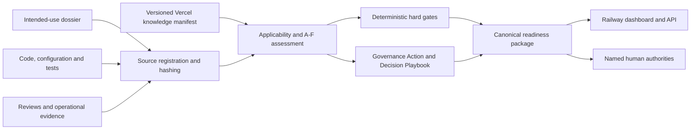

# Architecture

The AI Governance Engine is a standalone evidence-processing service. It reuses the useful shape of the FinOps Engine—parallel domain assessment, evidence verification, hard gates, controlled synthesis, traceability, and targeted action selection—without importing any FinOps domain model.

## Trust boundaries

- Uploaded content is untrusted evidence, not executable instruction. The server stores neither submitted files nor secrets.
- Evidence state is derived from artifact type. Code/configuration can establish only `IMPLEMENTED`; tests and scans can establish `TESTED`; operational records can establish `OPERATIONALLY_OBSERVED`.
- `HUMAN_VALIDATED` and `FORMALLY_APPROVED` require a non-engine actor identifier plus an allow-listed authority.
- Hard gates are deterministic and cannot be overridden by narrative generation.
- The output is a readiness recommendation. Approval, legal interpretation, privacy review, security acceptance, residual-risk acceptance, and deployment authorization remain named human acts.

## Deployment boundary

Railway runs the stateless application and serves the dashboard/API. Vercel hosts immutable, versioned knowledge documents and their manifest. In production, the engine fails closed when it cannot load the manifest or validate every document hash.

The canonical readiness package is the sole output contract. PDF, HTML, or a later Saidot connector should render or transfer that package rather than calculate a second result.
