# Architecture

## Decision-ready reporting

The canonical readiness package is the only source of truth. Source-first intake first builds a content-addressed `SourceIngestionManifest 1.0.0`, then a field-level `solutionProfile`, immutable `assessmentIntake 1.3.0`, versioned applicability questionnaire, and deterministic `documentationReadiness` before governance assessment. The engine then builds `transitionBoundary`, enriched hard gates, and the `assuranceSummary 1.5.0` view model before any cognitive synthesis. The browser renders two views over that same package:

The Intake boundary is defined by `intake-field-registry-1.0.0`. Every active field requires an explicit final user resolution; factual provenance remains separate from that decision state. `Unknown` is valid, `Not Applicable` is available only where the registry permits it and may require an explanation, and unresolved conflicts cannot be approved. The user-only approval action creates a frozen, content-hashed `approved-intake-snapshot-1.1.0` revision tied to the acquisition-manifest hash. Its proposal-decision ledger distinguishes acceptance, a subsequent user edit, and explicit decline without making decline a blocking field resolution. Cognitive execution revalidates that snapshot and consumes only its effective dossier and solution profile.

The acquisition manifest uses `evidence-acquisition-1.0.0` to record each parsed artifact's acquisition lane, raw-content policy, egress policy, analyzer version and derived-unit lineage. Documents follow `DOCUMENT_LOCAL_ANALYSIS`; `document-evidence-summary-1.0.0` exposes only allow-listed document classes, formats, coarse dimensions, topic/risk signals and limitations—never source text, names, values or quotes. Code and configuration are scanned locally without execution; `code-evidence-summary-1.0.0` emits only allow-listed artifact/language classes, coarse size and line ranges, controlled capability/risk signals, an opaque source reference and fixed limitations. CSV and XLSX follow `TABULAR_LOCAL_ANALYSIS`; `tabular-evidence-summary-1.0.0` exposes only coarse row/column/sheet ranges and allow-listed structure, semantic and risk signals—never headers, cells, formulas or sheet names. Images follow `MEDIA_LOCAL_METADATA`; `media-evidence-summary-1.0.0` exposes only media type and coarse size, never pixels or visible text. Static signal detection does not establish documentary claims, runtime behavior, data quality or control effectiveness. `acquired-fact-package-1.0.0` applies the Intake registry to deterministic observations: only validated Boolean or allow-listed enum values may be eligible, while free text, dates, unknowns, conflicts and policy-excluded values are represented with `value: null`. Any blocking screening result withholds every acquired value. A user selection creates `acquired-fact-selection-1.0.0`, tied to the package hash and appended only to the optional proposal packet; it never mutates deterministic Intake. The separately user-approved canonical Intake may enter analysis as declared information.

- **Assessment Workspace** for intake, detailed controls, evidence, execution diagnostics, and remediation work.
- **Assurance Summary** for owners, executives, and formal reviewers.

The summary renderer does not calculate readiness. Live HTML and printable PDF use the same ordered report-section markup; only pagination and interactive controls differ. The downloadable HTML is self-contained, has embedded CSS, contains no executable scripts or external assets, and escapes all untrusted values. It contains no Evidence Digest or raw excerpts. JSON remains the complete canonical audit record.

For `ReadinessPackageV2` 2.6.0 and cognitive contract 3.1.0, raw sources remain immutable and all OCR or multimodal interpretations are derived source units with parent lineage and conservative ceilings. Candidate solution and intake facts are independently verified before they enter shared context. Candidate claims pass local citation validation, independent semantic verification, bounded rescan/adjudication and a deterministic finding lock. Unsupported claims remain in the unresolved ledger. Item-level fact-checking can trigger one bounded claim re-adjudication or one wording repair, and every repair is checked again. A separate publication gate can withhold generated narrative without changing lifecycle readiness. The deterministic fallback package remains available as schema 1.4.0.

The AI Governance Engine is a standalone evidence-processing service. It reuses the useful shape of the FinOps Engine—parallel domain assessment, evidence verification, hard gates, controlled synthesis, traceability, and targeted action selection—without importing any FinOps domain model.

```mermaid
flowchart LR
  D["Untrusted sources"] --> P["Local parse, DLP and provenance"]
  P --> I["Cited intake draft and user-approved snapshot"]
  I --> S["Candidate solution facts"]
  S --> SV["Independent fact verification"]
  SV --> A["Parallel A-F candidate claims"]
  A --> V["Independent verification and bounded re-analysis"]
  V --> AC["Adjudicated and unresolved ledgers"]
  AC --> L["Deterministically locked findings only"]
  K["Versioned Vercel knowledge manifest"] --> G["Deterministic applicability, controls and hard gates"]
  L --> G
  G --> T["Exact approved playbook mapping"]
  G --> Y["Controlled synthesis"]
  T --> Y
  Y --> F["Independent narrative fact-check"]
  F --> R["Bounded repair or claim re-analysis"]
  R --> Q["Deterministic publication gate"]
  Q --> O["Canonical ReadinessPackageV2"]
  O --> H["Named human authorities"]
```

## Trust boundaries

- Uploaded content is untrusted evidence, not executable instruction. Raw bytes and extracted text are memory-only. Raw documents, code/configuration, tabular units and image pixels are local-only and are purged with the run; only their schema-validated deterministic summaries and user-approved Intake can enter provider packets. Hashes, claims, findings, model traces, and the package may survive the run under their stated acquisition policy.
- A packet is sent only after explicit packet/provider approval. The trace records provider, model, parameters, prompt/schema version, packet hash, usage, latency, retries, and output hash without recording credentials.
- Provider disagreement is not resolved by majority vote. Unresolved high/critical disagreement is routed to a named human authority.
- Knowledge Base content is criteria, never case evidence. Exact finding-definition IDs are required before an approved tactic can activate.
- Every applicable requirement, control, atomic assessment object, anti-pattern test, and finding definition receives an explicit coverage state. Domain failure yields a partial package and blocks positive progression rather than discarding successful domains.
- Evidence state is derived from artifact type. Code/configuration can establish only `IMPLEMENTED`; tests and scans can establish `TESTED`; operational records can establish `OPERATIONALLY_OBSERVED`.
- Lexical matches are `AUTOMATED_INDICATOR` records and cannot independently establish `IMPLEMENTED`. User confirmation creates a declaration but cannot manufacture documentary evidence or erase a contradiction.
- Deterministic acquisition and GenAI may create candidates, but only the user can resolve fields and approve the immutable Intake revision that analysis consumes.
- Deterministic acquisition runs without provider transmission. Optional GenAI Intake proposals require a separate explicit user request after the safe summary package is available for review; skipping proposals does not block user resolution or final Intake approval.
- Acquired facts are denied by default at the proposal boundary. Only user-selected, registry-eligible controlled facts enter a proposal packet; rejected IDs, ineligible values, stale package hashes and any package-integrity failure fail closed. Proposal acceptance and decline remain reversible until the user performs final approval.
- When PostgreSQL is configured, `durable-run-state-1.0.0` checkpoints only provider-eligible deterministic summaries, approved canonical Intake, orchestration status, traces and result state. Local source units and media bytes are structurally excluded. A content hash detects checkpoint corruption; optimistic versions reject stale writers; and a database lease serializes proposal, confirmation and execution mutations.
- `cognitive-step-ledger-1.0.0` enforces the ordered major phases from multimodal extraction through final fact-check. Executable phases checkpoint before and after work, optional multimodal work is explicitly skipped, and each boundary renews the execution lease. Checkpoint failure stops progression before another provider call. Active media bytes and model-derived visible text remain memory-only and are redacted from every step checkpoint.
- A run-scoped abort signal reaches the provider HTTP request and custom transports. User cancellation and process shutdown abort active calls; a timed lease heartbeat also aborts execution after ownership loss. Failure policy records a stable code and retry disposition, but does not automatically replay provider requests or interrupted steps. The only automatic retry remains one bounded structured-output schema repair.
- Missing critical case information enforces an `ISOLATED_SANDBOX` operating boundary. Deployment and operation require every applicable intake field to be documented, confirmed, and aligned with implementation.
- Known-irrelevant source exclusions remain visible but do not block progression. Unsupported source-like, failed, or unsafe evidence creates `SOURCE_COVERAGE_INCOMPLETE`; early work remains sandboxed and Deployment or later progression fails closed until the gap has scoped, attributable coverage.
- `HUMAN_VALIDATED` and `FORMALLY_APPROVED` require a non-engine actor identifier plus an allow-listed authority.
- Hard gates are deterministic and cannot be overridden by narrative generation.
- Missing cognitive stages create `COGNITIVE_ASSESSMENT_INCOMPLETE`; positive deployment progression fails closed.
- Synthesis sees only locked data. A different-provider fact-check quarantines unsupported prose and cannot alter deterministic results. Corrected prose requires a second check; grounding challenges reopen only the affected claim within a bounded re-adjudication cycle.
- `REPORT_READY`, `REPORT_WITH_LIMITATIONS`, and `REPORT_WITHHELD` describe publication integrity only and cannot improve a readiness recommendation.
- The output is a readiness recommendation. Approval, legal interpretation, privacy review, security acceptance, residual-risk acceptance, and deployment authorization remain named human acts.

## Deployment boundary

Railway can run the current service and dashboard/API with an optional PostgreSQL `DATABASE_URL`. Raw evidence remains process-local even when PostgreSQL is enabled. Approved Intake, queued safe-summary work and safe terminal checkpoints can recover after restart. Workers atomically claim queued records with expiring leases and bounded per-process concurrency. Queued media is affined to the worker holding its memory-only pixels; it cannot be claimed by another worker and requires re-upload if its owner restarts. A pre-approval checkpoint enters `RECOVERY_REQUIRES_REUPLOAD`; an interrupted active run enters `RECOVERY_REQUIRES_USER_RESTART` and can only be requeued through explicit user acknowledgement of possible duplicate calls. Memory-only media cannot be recovered and requires re-upload. Vercel hosts immutable, versioned knowledge documents and their manifest. In production mode, the engine fails closed when it cannot load the manifest or validate every document hash.

The canonical readiness package is the sole output contract. Deterministic 1.4.0 and cognitive 2.6.0 outputs pass a versioned local structural, JSON-safety, authority-boundary and content-hash validator before return or persistence; internal provisional synthesis input is not a publishable package. PDF, HTML, or a later external governance connector should render or transfer the validated package rather than calculate a second result.

## Provider portability

Evidence summaries, cognitive schemas, validation, provenance and finding-lock contracts are provider-neutral. The provider set is OpenAI, xAI Grok and Moonshot Kimi. Separate adapters translate the canonical request into OpenAI/xAI Responses API or Kimi Chat Completions shapes, normalize model identity and usage, and then apply the same final local schema validation. OpenAI-compatible endpoints are not treated as behaviorally identical: capability declarations and live qualification remain provider/model specific. Current documented model candidates are defaults only and can be pinned through server-side environment configuration after qualification. Raw evidence policy and explicit packet/provider approval are enforced before adapter selection.
